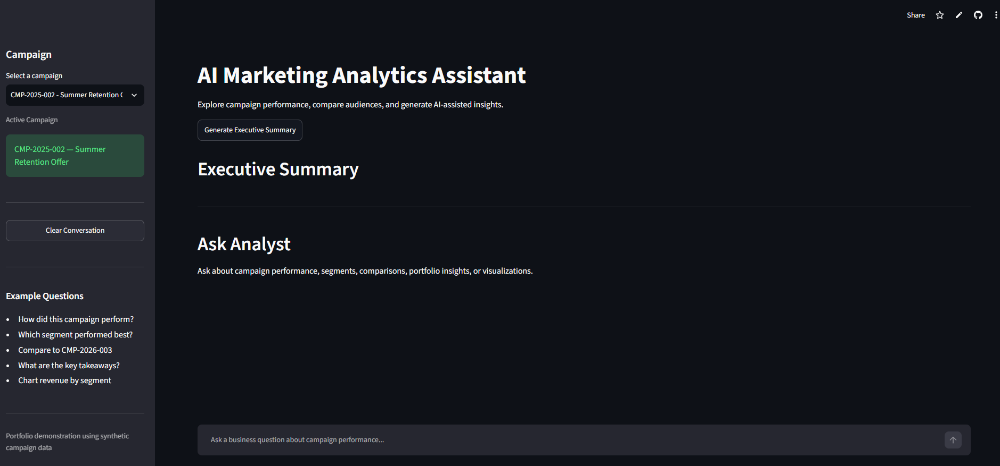
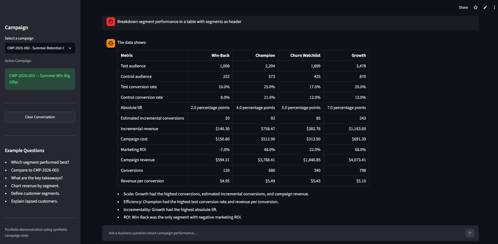
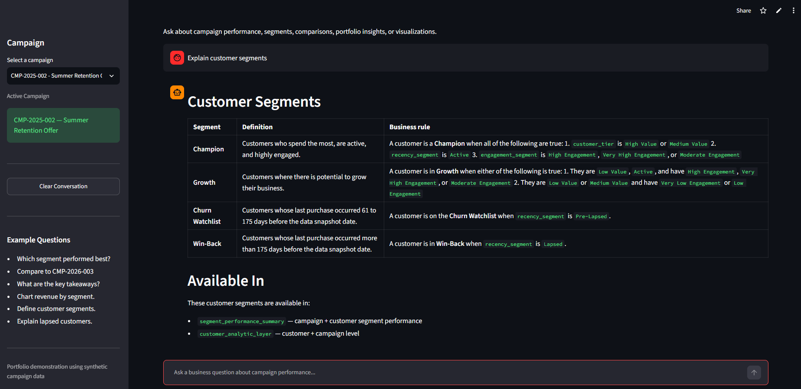
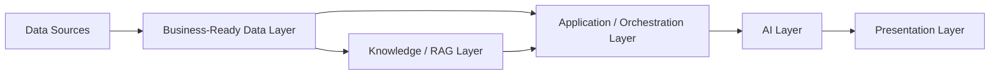
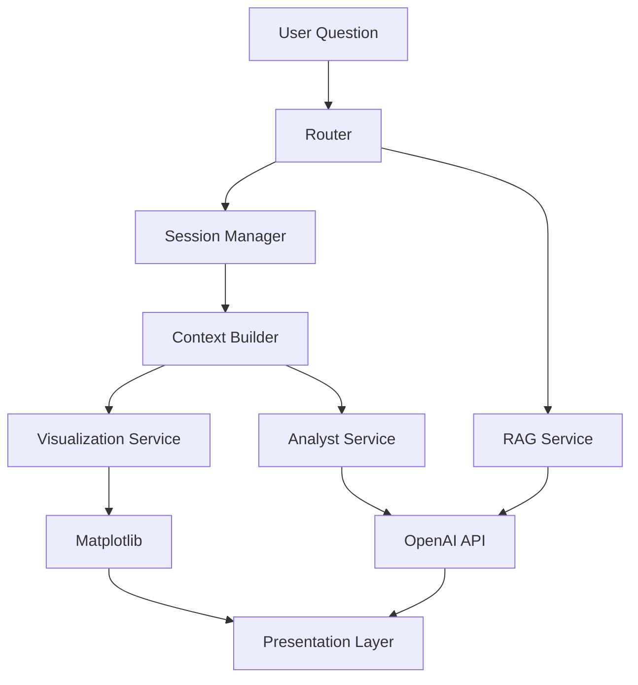

# AI Marketing Analytics Application

🚀 Live Demo:

https://campaign-analytics-ai.streamlit.app
An AI-powered analytics application that enables business users to explore marketing campaign performance and governed business knowledge using natural language. Generate executive summaries, compare campaigns, visualize key metrics, ask analytical questions, and retrieve trusted business definitions and metric logic through an interactive Streamlit interface.

This portfolio project demonstrates an end-to-end Business-Ready Data and AI workflow, from data transformation, modeling, testing, and governance through analytics and AI-assisted analysis. It combines PostgreSQL, dbt, Python, SQL, pgvector, Tableau, Streamlit, and the OpenAI API to support both structured analytics and retrieval-augmented generation (RAG).

## Application Screenshot

<p align="center">
  
</p>

<h4>AI-generated campaign summaries</h4>
<p align="center">
  
</p>

<h3>RAG Example</h3>
<p align="center">
  
</p>

## Key Features

- AI-generated executive campaign summaries
- Natural language "Ask Analyst" experience
- Campaign comparison and performance insights
- Interactive visualizations
- PostgreSQL development environment with CSV-powered demo deployment
- Configurable OpenAI models for balancing quality, latency, and cost

## Project Architecture



Data Layer
- PostgreSQL
- CSV Demo Data

Business-Ready Data Layer
- dbt Staging Models
- dbt Marts
- Data Quality Tests
- Business Rules
- SQL Extracts / Retrieval Queries

Knowledge / RAG Layer
- Markdown Business Knowledge
- Chunking
- Embedding
- pgvector
- Knowledge Retriebal

Application / Orchestration Layer
- Router
- Context Builder
- Session Manager
- Visualization Services
- RAG Service

AI Layer
- Prompt Templates
- OpenAI API

Presentation Layer
- CLI
- Streamlit
- Matplotlib

## Project Workflow



### SQL Analysis

Reusable SQL files are used to create campaign, customer, segment, and analytical summaries. SQL handles the primary filtering, aggregation, joins, and business logic before results are loaded into Python.

### Campaign Data

The project includes simulated campaign-result data loaded into PostgreSQL. These results support analysis such as:

- Campaign performance
- Customer response
- Segment performance
- Revenue and conversion metrics
- Engagement and recency patterns
- Campaign targeting opportunities

### Ask Analyst

Ask Analyst provides a conversational interface for exploring curated
campaign data.

Current capabilities include:

- Campaign performance summaries
- Segment-level performance analysis
- Campaign-to-campaign comparisons
- Customer-level campaign analysis
- Portfolio-level insights and derived signals
- Session-aware follow-up questions
- Active-campaign switching
- Campaign and segment visualizations
- AI interpretation grounded in the same data used to create each chart

### Visual Analytics

Ask Analyst can generate and interpret bar charts for:

- Campaign revenue
- Campaign conversion rate
- Segment revenue
- Segment conversion rate

Example questions:

- `Chart conversion rate by segment`
- `Plot campaign revenue`

### Data Validation

Validation is performed before Tableau extracts are created.

Current validation includes:

- Customer-level campaign-result checks
- Campaign-performance checks
- Dataset shape summaries
- Prevention of exports when critical validation errors are found

### Tableau Extracts

The Tableau extracts are refreshed through a separate export script rather than automatically through `main.py`. 
This keeps the dashboard data stable and prevents the underlying CSV files from being overwritten whenever the Ask Analyst application is run.

The extract workflow creates curated CSV files such as:

```text
campaign_performance_summary.csv
campaign_segment_summary.csv
campaign_analytic_layer.csv
campaign_tableau_summary.csv
```

These files are intended to serve as controlled Tableau data sources.


## Technology Stack

- **Database:** PostgreSQL, pgvector
- **Transformation / Analytics Engineering:** dbt Core, SQL
- **SQL client:** DBeaver
- **Programming language:** Python
- **Data processing:** pandas
- **Database access:** SQLAlchemy, psycopg2
- **Dashboarding:** Tableau
- **Python visualization:** Matplotlib
- **AI integration:** OpenAI API
- **Application interface:** Python CLI; Streamlit for Demo Mode
- **Development environment:** PyCharm
- **Testing:** pytest
- **Version control:** Git and GitHub

## Project Structure

```text
project-root/
|
app/
├── ai/
│   ├── analyst_chat.py
│   ├── context_builder.py
│   ├── prompt_builder.py
│   ├── prompt_loader.py
│   ├── session_state_manager.py
│   └── llm_client_api.py
├── config/
│   ├── paths.py
│   ├── router.py
│   └── settings.py
├── extracts/
├── generation/
├── sql/
├── ui/
├── utils/
└── visualization/
    ├── chart_builder.py
    ├── chart_dispatcher.py
    ├── campaign_charts.py
    └── segment_charts.py
prompts/
|-- main.py
|-- .env
|-- .gitignore
|-- requirements.txt
`-- README.md
```

The exact structure may evolve as the Ask Analyst functionality is expanded.

## Retrieval-Augmented Generation (RAG)

The application supports business-knowledge questions using a Retrieval-Augmented Generation (RAG) workflow.

Structured analytics questions, such as campaign or segment performance, continue to use governed dbt marts and the existing context-building workflow.

Knowledge questions, such as:

- What does Churn Watchlist mean?
- How is Marketing ROI calculated?
- What quality checks apply to campaign performance?

are routed to the RAG service.

Business definitions, metric documentation, data-product descriptions, and data-quality rules are maintained as Markdown knowledge documents. These documents are chunked by business concept, converted to embeddings, and stored in PostgreSQL using pgvector.

At query time, the user question is embedded and compared with the stored vectors. The most relevant knowledge chunks are retrieved and supplied to the LLM as grounded context.

This design separates structured analytical retrieval from business-knowledge retrieval while allowing both paths to support the same AI assistant.

### RAG Knowledge Store

The `ai.knowledge_chunks` table stores the business knowledge used by the RAG workflow.

| Column | Description |
|---|---|
| `id` | Unique identifier for the stored knowledge chunk |
| `source` | Markdown source file, such as `segments.md` or `metrics.md` |
| `title` | Business concept represented by the chunk |
| `content` | Full Markdown content for the business concept |
| `embedding` | 1536-dimensional vector representation generated by the embedding model |

The table is stored in the `ai` PostgreSQL schema rather than the dbt-managed `dbt_dev` schema because the table is populated by the AI knowledge-ingestion process rather than by dbt.

### Knowledge Ingestion Flow

Business knowledge is maintained in:

- `segments.md`
- `metrics.md`
- `data_products.md`
- `data_quality.md`

The ingestion workflow is:

Markdown documents  
→ load documents  
→ split into semantic chunks using Markdown `##` headings  
→ generate embeddings  
→ store chunk text, metadata, and vectors in `ai.knowledge_chunks`

The current implementation rebuilds the knowledge store when the documentation is refreshed rather than performing incremental updates.

## Setup

### 1. Clone the repository

```bash
git clone https://github.com/drekicks/marketing_analytics.git
cd marketing_analytics
python -m venv .venv
```

### 2. Create and activate a virtual environment

Windows:

```bash
python -m venv .venv
.venv\Scripts\activate
```

macOS or Linux:

```bash
python3 -m venv .venv
source .venv/bin/activate
```

### 3. Install dependencies

```bash
pip install -r requirements.txt
```

### 4. Configure environment variables

Create a `.env` file in the project root.

Example:

```env
DB_HOST=localhost
DB_PORT=5432
DB_NAME=dvdrental
DB_USER=your_username
DB_PASSWORD=your_password
```

Additional variables may be required for the AI integration.

Do not commit the `.env` file to GitHub.

### 5. Load the database

Install PostgreSQL and restore the `dvdrental` sample database. Then run any project-specific SQL needed to create the campaign tables, views, or analytical layers.

## dbt Setup

The application uses dbt Core with the PostgreSQL adapter to build and validate the business-ready analytical layer.

Install:

```bash
pip install dbt-postgres

Configure dbt profile in:
~/.dbt/profiles.yml

dbt debug
dbt build
```
## pgvector Setup

The RAG workflow uses the pgvector PostgreSQL extension to store and search embedding vectors.

After installing pgvector for the local PostgreSQL instance, enable the extension in the application database:

```sql
CREATE EXTENSION IF NOT EXISTS vector;
```

```sql
CREATE TABLE ai.knowledge_chunks (
    id bigserial primary key,
    source text not null,
    title text not null,
    content text not null,
    embedding vector(1536) not null
);
```

## Running the Project

### Run Ask Analyst

From the project root:

```bash
python -m app.main
```

This runs the application without refreshing the Tableau CSV extracts.

### Refresh Tableau Extracts

Run the campaign extract workflow separately:

```bash
python -m app.extracts.campaign_extract
```

## Example Extract Logic

```python
extracts = load_sql_extracts(
    [
        "campaign_performance_summary",
        "campaign_segment_summary",
        "analytic_layer",
    ]
)

performance_df = extracts["campaign_performance_summary"]
segment_df = extracts["campaign_segment_summary"]
analytic_df = extracts["analytic_layer"]
```

The DataFrames are loaded directly from SQL. CSV is used as a downstream reporting format rather than as the primary source for the Python analysis.

## Design Decisions

### SQL as the primary analytical source

SQL is used to create the analytical datasets because it keeps business logic centralized, reusable, and close to the database.

### CSV as a controlled reporting artifact

CSV files are used for Tableau compatibility, portability, and point-in-time snapshots. They are not automatically regenerated each time the main application runs.

### Separate Tableau and Ask Analyst execution

The Tableau export script is intentionally separate from `main.py`. This allows a user to begin with a stable Tableau dashboard and then continue the analysis in Ask Analyst using the same approved data context.

### Validation before export

Tableau outputs are only created after the underlying campaign data passes validation. This reduces the risk of publishing incomplete or inconsistent reporting datasets.

## Versioning

The project uses Git tags and GitHub Releases for meaningful milestones.

Version sequence:

- v0.5.0  Initial Ask Analyst integration
- v0.6.0  Campaign and segment analysis
- v0.7.0  Insight Explorer and derived signals
- v0.8.0  Session management and conversational context
- v0.9.0  Visual analytics
- v1.0.0  Hosted Streamlit portfolio demo
- v1.1.0  Business-Ready Data + RAG

Normal development changes should use descriptive commit messages. Tags should be reserved for meaningful project versions.

## Business Value

This project reflects a practical analytics workflow rather than a single dashboard or isolated script. It demonstrates the ability to:

- Translate business questions into analytical logic
- Build reusable SQL and Python components
- Validate data before publishing results
- Support both dashboard and conversational analysis
- Separate operational workflows to protect reporting consistency
- Communicate technical outputs in a business-friendly format

## Data Source
The project extends the PostgreSQL dvdrental sample database with simulated marketing campaign data, customer segmentation, reusable SQL extracts, validation checks, Tableau-ready datasets, and an AI-powered conversational analysis layer. It was designed to demonstrate an end-to-end analytics solution, from source data and transformation through reporting, validation, visualization, and natural-language insight generation.

## Future Vision

- [ ] Cross-object analytical datasets
- [ ] Data-quality assistant
- [ ] AI-generated explanations aligned with visualization datasets
- [ ] Tableau dashboard integration with AI drill-through
- [ ] Additional visualization types (trend, distribution, composition)
- [ ] Retrieval-Augmented Generation (RAG) for customer-level analysis
- [ ] Multi-agent architecture for specialized analytics workflows
- [ ] Scenario planning and forecasting capabilities

## License

This project is intended for educational and portfolio use. Add an open-source license before distributing or accepting external contributions.
